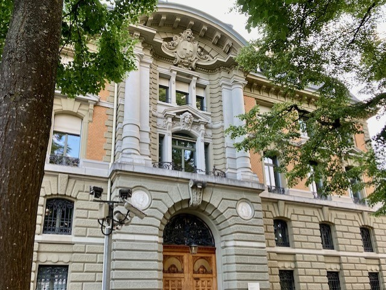

+++
title = "Faszination Münzen "
date = "2023-06-16"
draft = false
pinned = false
image = "swissmint-muenzstaette-5-1280x730px-1-1280x730.jpg"
description = "Die Welt der Münzen - faszinierend und näher als man denkt."
+++


Mitten im Kirchenfeldquartier steht ein stattliches Gebäude im Neorenaissance-Stil aus rotem Backstein. Die Fenster sind mit dicken Gitterstäben geschützt und nur die Reliefmedaillons und die dezenten Gemälde unter dem Dachrand verraten, was drinnen vor sich geht. Bei dem Gebäude handelt es sich um die Swissmint, die Eidgenössische Münzstätte. Hier werden alle Umlaufmünzen der Schweiz und auch die begehrten Sondermünzen geprägt. Tauchen wir ein in die Welt der Münzen, denn sie ist faszinierend und sie ist näher, als man meint. 



Nora Imoberdorf, Elisabeth Voller und Lia Werren

### Vom Rohling zur Münze

Das regelmässige Geräusch der Prägemaschinen erfüllt den hohen Raum im Untergeschoss. Ein Metallrohling kommt in die Maschine und dann geschieht alles sprichwörtlich auf einen Schlag. Unter hohem Druck werden Vorderseite, Rückseite und Rand in den Rohling geprägt. Innert kürzester Zeit wird aus dem glatten Metall eine strukturierte, dekorierte Münze, wie wir sie täglich sehen und gebrauchen. 

Das Metall Schweizer Münzen stammt nicht aus der Schweiz, sondern aus Südkorea. Seit der Umstellung vom Silber- zu Kupfernickelgeld im Jahre 1968 stellt die Münzstätte ihre Rohlinge nicht mehr selbst her, sondern bestellt die fertigen Münzplättchen bei externen Lieferanten. Woher die Rondellen kommen, hängt vom besten Angebot und dabei vor allem vom Preis ab. Dies entspricht den Beschaffungsvorschriften des Bundes, erklärt Jan Niklas Betz, Leiter Marketing und Verkauf und stellvertretender Leiter der Swissmint. 

Ein grosser Lastwagen steht vor dem roten Gebäude der Swissmint. Ein Lastwagen voll mit Geld. Die Münzen, die im Alltag benutzt werden, werden in diesem Gebäude im Kirchenfeldquartier geprägt. 150 bis 750 Münzen pro Minute. Die silbernen Geldstücke kullern auf die Verpackungsstrasse, wo sie gezählt und anschliessend in Rollen zu 25 beziehungsweise 50 Stück verpackt werden. 

Langsam setzt sich das Fahrzeug wieder in Fahrt und transportiert die Münzen in Richtung Schweizer Nationalbank – SNB. Dort werden sie in Tresoren gelagert und warten darauf, als alltägliches Austauschmittel für Waren und Dienstleistungen zu dienen und in den Umlauf gebracht zu werden. 

Doch nicht alle Münzen werden in den Lastwagen geladen. Einige bleiben in der Swissmint. Ihre einzigartigen Motive und ihr Material unterscheiden sich von den Alltagsmünzen. Ihre Anzahl ist begrenzt und die Nachfrage nach ihnen ist gross. Das sind die Sondermünzen. Herausragende Schweizer Ereignisse, Geschichten und Persönlichkeiten prägen buchstäblich ihre Oberflächen. 2022 war es etwa der Berner Troubadour Mani Matter. Dieses Beispiel zeigt anschaulich: Münzen sind zuverlässige Zeitzeugen. Sie erinnern daran, wie vieles vor der jetzigen Zeit war und wie wenig oftmals darüber bekannt ist. Jede dieser Münzen ist ein kleines Kunstwerk, das mit Sorgfalt und Detailreichtum gestaltet wird. Die Verwendung von Symbolen, Porträts und Inschriften auf Münzen ermöglicht es Numismatikern, die damalige Kultur, Kunst und sogar die politische Propaganda zu analysieren. Momentan scheint bei Numismatikern die Faszination für Keltische Münzen besonders gross zu sein. Was früher Umlaufmünzen waren sind heute begehrte Sammlerstücke. Münzen sind nicht nur ein Zahlungsmittel, sondern auch Ausdruck von Macht, Identität und Schönheit. Geschichte, die inspiriert; Geschichte, die fasziniert. Wer oder was 2023 die Sondermünze zieren wird, war allerdings zum Zeitpunkt des Interviews noch geheim. 

Nicht nur die Sondermünzen der Swissmint begeistern Numismatiker rund um die Welt. Auch antike Sammlerstücke sind an Münzmessen, wie der BERNA, welche dieses Jahr bereits zum 50. Mal zahlreiche Münzbegeisterte anlockt, begehrt. Das erklärt Beat A. Klein, der Präsident des Numismatischen Vereins Bern (NVB). Die Faszination der Numismatik liegt in der Vielfalt der Münzen, ihrer künstlerischen Gestaltung und der Geschichten, welche sie erzählen. 

> «Das fasziniert mich. Das Wissen der alten Kulturen über Metallurgie.»
>
> \- Beat A. Klein

### Begehrtes Falschgeld

Auf Münzmessen werden begehrte Stücke teilweise zu sehr hohen Preisen verkauft, und da möchte natürlich kein*e Numismatiker*in eine Fälschung kaufen. Oder etwa schon? 

Grundsätzlich sind Münzfälschungen in der Schweiz kein Problem und die Fallzahlen bewegen sich im Promillebereich klärt uns Jan Niklas Betz auf. «Es gab aber einmal eine grosse Fälschung im Jahr 1991, da ist eine Fälschung von Fünffränklern in die Schweiz gekommen.» Zu diesem Zeitpunkt hatte die SNB die Fünfliber aus dem Jahr noch nicht herausgeben und konnte rechtzeitig eingreifen. Sie liess alle gelagerten Stücke zerstören, was zur Folge hat, dass es keine Fünfliber aus dem Jahr gibt. «Die einzigen Fünffränkler aus dem Jahr sind die aus dem offiziellen Münzsatz», präzisiert Betz. 

Während die Nationalbank bestrebt ist, Fälschungen möglichst aus dem Umlauf zu nehmen, suchen die Münzsammler aber laut der Nachrichtensendung «Echo der Zeit» genau nach diesen Fälschungen. Die falschen Fünfliber zählen unter Sammlern bisweilen zu den Wertvollsten. Für solch rare Stücke sind sie bereit, ein Vielfaches des aufgeprägten Werts zu zahlen. 



### Echt oder falsch?

Falschmünzen sind in der Schweiz kein verbreitetes Problem, aber nach wie vor ein Thema. Dies gilt sowohl für die Umlauf- als auch für die Sammlermünzen. 2022 wurden in der Swissmint 21'000'000 Münzen geprägt und laut der Falschgeldstatistik des Eidgenössischen Justiz- und Polizeidepartements – EJPD 3'338 Prägefälschungen entdeckt. 
Immer wieder entpuppen sich Fünffrankenstücke als Fälschung. Oft stammen diese aus mechanisch versierten Fälscherwerkstätten in Italien. Fälscherwerkstätten und der Handel mit gefälschten Münzen werden von Strafverfolgungsbehörden sowohl schweizweit als auch weltweit bekämpft.
Auch qualitativ hochstehende Fälschungen von seltenen und teuren Sammlerstücken sind vermehrt auf dem Markt zu finden. Insbesondere beim Onlinekauf von Münzen ist Vorsicht geboten.

Nur, wie erkennt man gefälschte Münzen?

Optisch kann überprüft werden, ob Unstimmigkeiten in der Prägung der Oberflächen oder der Randprägung vorhanden sind. Grösse und Gewicht der Münzen können ebenfalls kontrolliert werden. Die Messungen können mit den technischen Daten der Schweizer Münzen auf der Webseite der Nationalbank oder Swissmint verglichen werden. Selbst der Klang einer Münze kann einen Hinweis darauf geben, ob ein Geldstück gefälscht ist. Letzteres erfordert jedoch etwas Übung und kann rasch einmal täuschen.

Wesentlich einfacher ist es, einen Bargeldautomaten wie den Kassenautomaten im Parkhaus, den Billetautomaten an der Tramhaltestelle oder den Getränkeautomaten am Bahnhof die Prüfung vornehmen zu lassen. Einzige Voraussetzung: Die Münze darf nicht statisch geladen sein.



### Wahrer Wert und effektive Kosten

Was ist nun der wahre Wert einer Münze? Wieviel kostet die Herstellung unseres Geldes? 

«Man kann sich vorstellen, dass jede Münze weniger in der Produktion kostet als das, was darauf steht», erklärt Betz. Die Stückkosten der Münzen hängen von den Metallpreisen, der Grösse des Prägeprogramms, aber auch von den Bestellmengen der jeweiligen Münzart ab. Nächstes Jahr zum Beispiel muss die Swissmint 70 Millionen neue Münzen für die SNB produzieren, das ist im Vergleich zu anderen Jahren viel. Grundsätzlich liegt der Produktionswert der Münzen jedoch immer unter ihrem Nominalwert. Dabei hat die 5 Rappen-Münze im Vergleich zu den anderen Münzen den verhältnismässig höchsten Produktionspreis: Eine 5-Rappen-Münze kostet laut den vom Bundesrat veröffentlichten Daten, stand 2012, 4.22 Rappen, während eine 5 Franken-Münzen nur gerade 36.30 Rappen kostet. 

Das war allerdings nicht immer so. Früher bestanden die Münzen aus Silber 0.835. Als aber der Silberpreis den Wert der Münzen überstieg, musste der Bund reagieren und 1968 auf die billigere Kupfernickellegierung ausweichen. Eine Ausnahme bildet der Fünfliber, aus Silber, der der 1969 zum letzten Mal produziert wurde. Die Ausserkurssetzung aller Silbermünzen wurde auf den 1. April 1971 festgesetzt und später bis zum 31. März 1972 verlängert. 

### Münzen, wie weiter?

Erst seit der Bundesverfassung von 1848 gibt es in der Schweiz eine einheitliche gemeinsame Währung. 1850 fiel der Entscheid, einheitliche Münzen zu prägen, davor wurden Münzen kantonal ausgegeben. Zuerst geschah dies an mehreren Standorten, unter anderem in Paris und Strassburg. Seit 1906 produziert jedoch die Swissmint als einzige Münzstätte sämtliche nationalen Umlaufmünzen der Schweiz. Damit ist Swissmint nicht nur die einzige, sondern auch die letzte Münzstätte der Schweiz. Aber wie lange noch?

Mit der Digitalisierung werden immer mehr Fragen zur Zukunft von bisher analogen Dingen aufgeworfen. Wie lange es noch physische Münzen geben wird, ist eine dieser Fragen. Die Absichten Schwedens, Norwegens und Finnlands ihr Bargeld sehr bald komplett abzuschaffen, führen auch zu Diskussionen in der Schweiz. Die Attraktivität des kontaktlosen Zahlens mit Karten oder Bezahl-Apps wie TWINT nimmt auch in der Schweiz zu. Gründe wie Onlineshopping, Hygiene und Geschwindigkeit senken den Stellenwert des Bargelds. 

Jan Niklas Betz ist jedoch zuversichtlich und vertritt klar die Meinung, dass das Bargeld in der Schweiz noch lange nicht verschwinden wird. Er verweist dabei darauf, dass selbst Schweden das Bargeld trotz erfolgter kompletter Abschaffung nach einem Stromausfall wieder eingeführt hat und dass Österreich gerade erst mit der Kampagne «Ich zahle bar» gezeigt hat, dass Bargeld weiterhin Vorteile mit sich bringt. 

> «Es ist nicht das schnellste Zahlungsmittel, aber es hinterlässt keine Abdrücke.»
>
> \- Jan Niklas Betz

Was im Zusammenhang mit der Geldwäsche verhindert werden soll, kann für den Einzelnen in einer immer gläserner werdenden Welt trotzdem eine Qualität sein. «Wer will schon, dass jeder herausfinden könnte, wieviel Bier man am Wochenende auf dem Fest bezahlt hat?»

Nur: Was, wenn nicht bar bezahlt werden kann? Was tun, wenn der Automat die eingeworfene Münze nicht akzeptieren will? Bezahlen am Automaten kann durchaus seine Tücken haben – der stellvertretende Leiter der Swissmint hat aber auch hier einen guten Rat. Man müsse das Geldstück einfach an den metallenen Einwurfschlitz des Automaten halten, damit die Münze sich entladen kann. Das oft zu Unrecht empfohlene Reiben bringt also nichts. Danach sollte der Automat die Legierung wieder lesen können und somit wissen, dass es sich um eine echte Münze handelt. Sollte es auch dann nicht funktionieren, ist es eine Fälschung. 

Funktioniert es aber, kullert leise die echte Münze in den Automaten und es erklingt das erfreuliche Geräusch der Maschine. Kurz darauf erscheint das bezahlte Ticket.